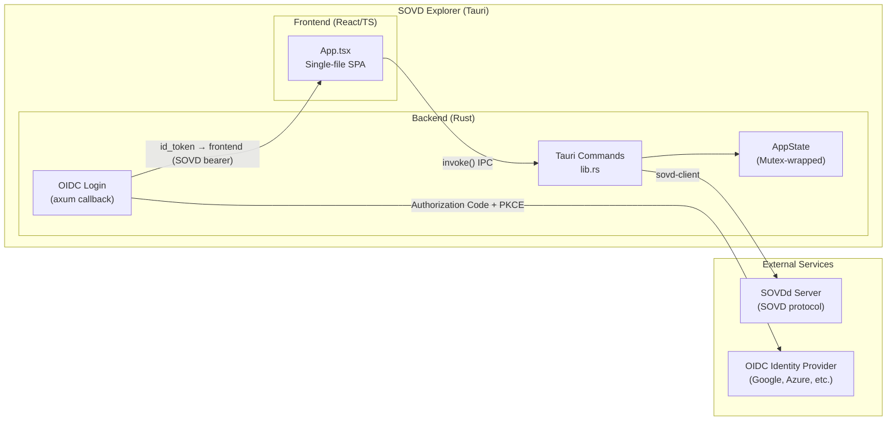
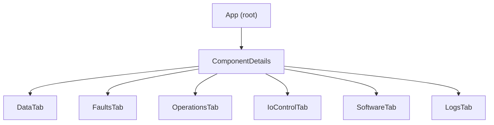
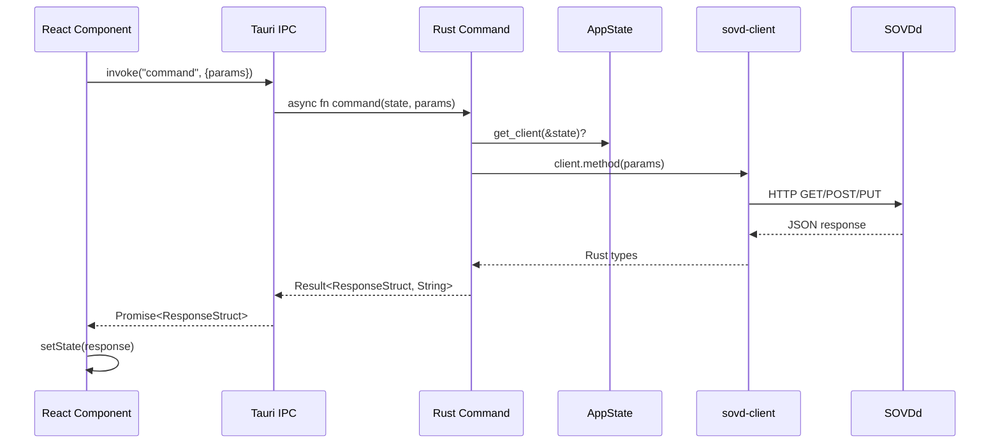
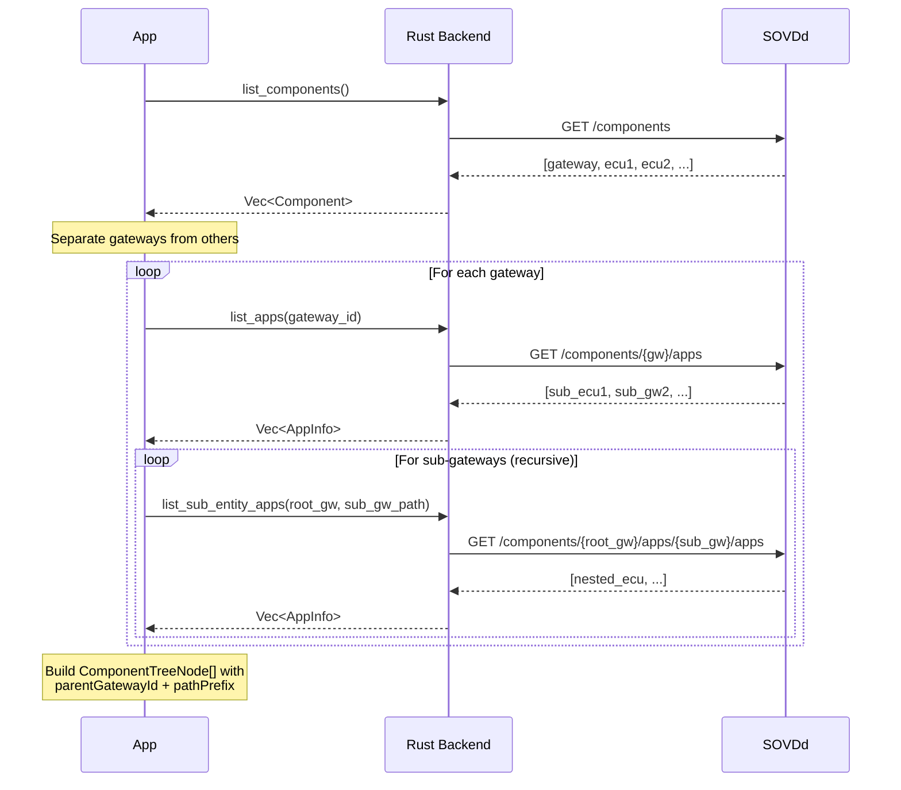
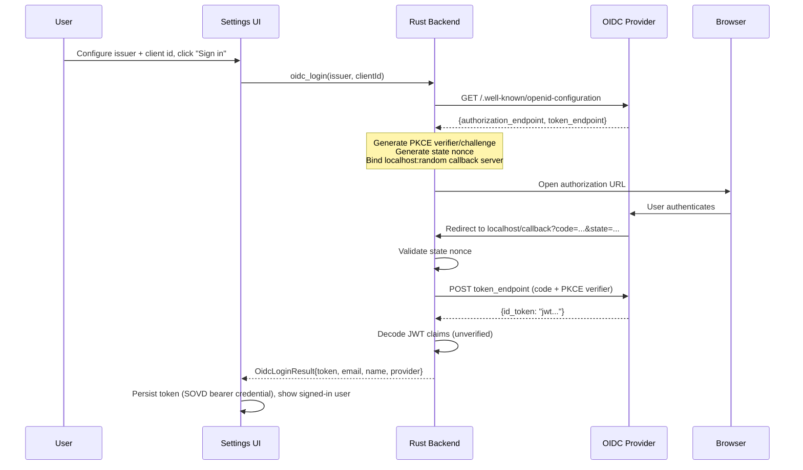

# Architecture: SOVD Explorer

> Refreshed 2026-07-18 — the offboard SOVD-security-helper integration is retired: SOVD
> servers unlock UDS SecurityAccess themselves, server-side, when a request carries a
> valid JWT, so the client-side seed→key choreography, the helper settings, and the
> helper HTTP client are gone. OIDC sign-in stays (issuer + client id configured in
> Settings). Flash-driving rides the SOVDd `/updates` wire (ISO 17978-3 §7.18).

## Overview

SOVD Explorer is a desktop GUI for interacting with automotive ECUs via the **SOVD (Service-Oriented Vehicle Diagnostics)** protocol. It connects to a SOVDd server, discovers vehicle components (ECUs and gateways), and provides a tabbed interface for reading/writing parameters, viewing faults, executing operations, controlling I/O, performing firmware updates, and managing diagnostic sessions. UDS security access is the server's concern — the UI only displays the server-reported security state. ECUs behind gateways are accessed via spec-compliant sub-entity routing (SOVD §6.5).

**Stack:** Tauri 2 (Rust backend + React/TypeScript frontend), Vite bundler, local `sovd-client` and `sovd-uds` crates for SOVD protocol communication.

| Language   | Files | Code Lines |
|------------|-------|------------|
| Rust       | 4     | ~1,500     |
| TSX        | 2     | ~3,150     |
| CSS        | 2     | ~2,000     |
| TypeScript | 2     | 19         |
| Other      | 22    | ~9,100     |
| **Total**  | **32**| **~15,800**|

## Project Structure

```
SOVD-explorer/
├── src/                          # Frontend (React + TypeScript)
│   ├── App.tsx                   # Entire UI: all components, state, Tauri IPC
│   ├── App.css                   # All application styles
│   ├── index.css                 # Base/reset styles, dark theme globals
│   ├── main.tsx                  # React entry point
│   └── vite-env.d.ts            # Vite type declarations
├── src-tauri/                    # Backend (Rust / Tauri)
│   ├── src/
│   │   ├── lib.rs               # All Tauri commands, AppState, IPC bridge, OIDC flow
│   │   └── main.rs              # Binary entry point (calls lib::run)
│   ├── Cargo.toml               # Rust dependencies
│   ├── tauri.conf.json           # Tauri window config, build settings
│   └── capabilities/default.json # Tauri permissions (core + shell:open)
├── scripts/                      # Setup and prerequisite installation
└── docs/                         # Protocol documentation
```

## System Architecture


```mermaid
graph LR
    subgraph Desktop["SOVD Explorer (Tauri)"]
        subgraph Frontend["Frontend (React/TS)"]
            App["App.tsx<br/>Single-file SPA"]
        end
        subgraph Backend["Backend (Rust)"]
            Commands["Tauri Commands<br/>lib.rs"]
            State["AppState<br/>(Mutex-wrapped)"]
            OIDC["OIDC Login<br/>(axum callback)"]
        end
    end

    subgraph External["External Services"]
        SOVDd["SOVDd Server<br/>(SOVD protocol)"]
        IdP["OIDC Identity Provider<br/>(Google, Azure, etc.)"]
    end

    App -- "invoke() IPC" --> Commands
    Commands -- "sovd-client" --> SOVDd
    Commands --> State
    OIDC -- "Authorization Code + PKCE" --> IdP
    OIDC -- "id_token → frontend (SOVD bearer)" --> App
```

## Module Hierarchy

The application is a **single-module monolith** — both frontend and backend are each contained in a single file.

### Backend (`src-tauri/src/lib.rs` — ~1,500 lines)

Flat structure: one `pub fn run()` entry point, 38 Tauri command functions, ~17 response structs, 1 `AppState` struct, 1 embedded axum callback server for OIDC.

**AppState** (line 16):
| Field | Type | Purpose |
|-------|------|---------|
| `client` | `Mutex<Option<SovdClient>>` | Active SOVD connection |
| `server_url` | `Mutex<String>` | Connected server URL |
| `flash_client` | `Mutex<Option<FlashClient>>` | Active flash session |
| `current_flash_component` | `Mutex<Option<String>>` | ECU being flashed |
| `current_flash_gateway` | `Mutex<Option<String>>` | Gateway id for an in-flight sub-entity flash — routes the identData (F189) installed-version read through the gateway |
| `http_client` | `reqwest::Client` | HTTP client for the OIDC flow (discovery + token exchange) |

### Frontend (`src/App.tsx` — ~3,150 lines)

All components in one file:


```mermaid
graph TD
    App["App (root)"] --> CD["ComponentDetails"]
    CD --> DataTab["DataTab"]
    CD --> FaultsTab["FaultsTab"]
    CD --> OpsTab["OperationsTab"]
    CD --> IOTab["IoControlTab"]
    CD --> SwTab["SoftwareTab"]
    CD --> LogsTab["LogsTab"]
```

| Component | Lines | Key Props | Purpose |
|-----------|-------|-----------|---------|
| `App` | 233–607 | — | Root: connection, sidebar tree, settings modal, OIDC sign-in |
| `ComponentDetails` | 622–1080 | `componentId, gatewayComponentId?, pathPrefix?, allComponentIds` | Tab container: derives `apiComponentId` and `modeTarget` for gateway routing; fetches ECU info, session, security state |
| `DataTab` | 1102–1421 | `parameters, values, componentId, paramPrefix?, onWriteParameter, monitoring, previousValues` | Parameter read/write with search, monitoring, source column for gateway views |
| `FaultsTab` | 1432–1473 | `faults, loading` | DTC list display |
| `OperationsTab` | 1486–1639 | `componentId, session, security, paramPrefix?` | Start/stop/result for diagnostic operations |
| `LogsTab` | 1645–1725 | — (uses LogContext) | Activity log table with filter, export, clear |
| `IoControlTab` | 1761–2046 | `componentId, session, security, paramPrefix?` | Freeze/adjust/reset I/O controls with auto-refresh |
| `SoftwareTab` | 2165–3149 | `componentId, gatewayComponentId?, modeTarget?, apiComponentId, session, onUpdateComplete, allComponentIds` | Firmware update: upload, flash, reset, commit/rollback; gateway-aware flash routing |

## Core Types

### Backend Response Structs


```mermaid
classDiagram
    class AppState {
        +client: Option~SovdClient~
        +server_url: String
        +flash_client: Option~FlashClient~
        +current_flash_component: Option~String~
        +http_client: reqwest::Client
    }

    class ConnectionStatus {
        +connected: bool
        +server_url: String
        +error: Option~String~
    }

    class SessionInfo {
        +id: String
        +value: String
    }

    class SecurityInfo {
        +id: String
        +value: String
    }

    class UploadResult {
        +upload_id: String
        +file_id: Option~String~
        +state: String
    }

    class FlashResult {
        +transfer_id: String
        +state: String
        +blocks_transferred: u32
        +blocks_total: u32
        +percent: Option~f64~
        +error: Option~String~
    }

    class ActivationInfo {
        +supports_rollback: bool
        +state: String
        +active_version: Option~String~
        +previous_version: Option~String~
    }

    class CommitRollbackResult {
        +success: bool
        +message: Option~String~
    }

    class OidcLoginResult {
        +token: String
        +email: Option~String~
        +name: Option~String~
        +provider: String
    }
```

### Frontend Key Types

| Type | Fields | Used By |
|------|--------|---------|
| `ComponentTreeNode` | `component, children, expanded, parentGatewayId?, pathPrefix?` | Sidebar tree (supports nested gateway hierarchies) |
| `AppInfo` | `id, name, description?, status?, type?, href?` | Sub-entity discovery via `list_apps` |
| `SessionMode` | `"default" \| "extended" \| "programming" \| "engineering"` | Session management |
| `FlashPhase` | 11 states: `idle → uploading → ... → committed/rolledback` | SoftwareTab state machine |
| `ActivationInfo` | `supports_rollback, state, active_version, previous_version` | Commit/rollback UI |
| `ExistingTransfer` | `transfer_id, state, error, component_id` | Cross-ECU transfer warnings |
| `OidcLoginResult` | `token, email, name, provider` | OIDC sign-in result |
| `LogEntry` | `timestamp, type, component, action, details, success` | Activity logging |

## Data Flow

### General Pattern


```mermaid
sequenceDiagram
    participant UI as React Component
    participant IPC as Tauri IPC
    participant Cmd as Rust Command
    participant State as AppState
    participant SDK as sovd-client
    participant Server as SOVDd

    UI->>IPC: invoke("command", {params})
    IPC->>Cmd: async fn command(state, params)
    Cmd->>State: get_client(&state)?
    Cmd->>SDK: client.method(params)
    SDK->>Server: HTTP GET/POST/PUT
    Server-->>SDK: JSON response
    SDK-->>Cmd: Rust types
    Cmd-->>IPC: Result<ResponseStruct, String>
    IPC-->>UI: Promise<ResponseStruct>
    UI->>UI: setState(response)
```

### Component Discovery (Gateway + Sub-Entity Tree)


```mermaid
sequenceDiagram
    participant App
    participant BE as Rust Backend
    participant SOVDd

    App->>BE: list_components()
    BE->>SOVDd: GET /components
    SOVDd-->>BE: [gateway, ecu1, ecu2, ...]
    BE-->>App: Vec<Component>

    Note over App: Separate gateways from others

    loop For each gateway
        App->>BE: list_apps(gateway_id)
        BE->>SOVDd: GET /components/{gw}/apps
        SOVDd-->>BE: [sub_ecu1, sub_gw2, ...]
        BE-->>App: Vec<AppInfo>

        loop For sub-gateways (recursive)
            App->>BE: list_sub_entity_apps(root_gw, sub_gw_path)
            BE->>SOVDd: GET /components/{root_gw}/apps/{sub_gw}/apps
            SOVDd-->>BE: [nested_ecu, ...]
            BE-->>App: Vec<AppInfo>
        end
    end

    Note over App: Build ComponentTreeNode[] with<br/>parentGatewayId + pathPrefix
```

### Firmware Update Flow

Drives the SOVDd **`/updates`** wire (ISO 17978-3 §7.18) since commit `4901d6c` — the older
`/files` + `/flash` polling flow is gone. The backend `FlashClient` maps the UI phases onto
`open_update → upload_part("manifest") → prepare → execute(orchestrated) → commit/rollback`.

```mermaid
sequenceDiagram
    participant User
    participant SW as SoftwareTab
    participant BE as Rust Backend
    participant ECU as SOVDd /updates (§7.18)

    User->>SW: Select package + "Start Update"
    SW->>BE: flash_init(componentId, gatewayId?)
    SW->>BE: flash_upload(data)   %% PUT /updates/{id}/bulk-data/manifest
    SW->>BE: flash_verify()       %% PUT prepare — verifies the manifest
    SW->>BE: set_session(apiComponentId, "programming", modeTarget?)
    SW->>BE: flash_start()        %% PUT execute?x-sumo-control=orchestrated
    Note right of BE: execute is synchronous on the wire (it polls /updates<br/>internally) and returns a TERMINAL state — no flash-phase<br/>polling loop in the UI; blocks_* unused, percent only.
    BE-->>SW: FlashResult{percent, state}

    alt Banked — execute pauses at awaiting-verdict (= activated, trial)
        SW->>BE: flash_finalize()       %% back-compat no-op (execute already finalized)
        SW->>BE: flash_reset_ecu()      %% UDS 0x11 when the orchestrator is ready
        loop Background poll (3s)
            SW->>BE: flash_get_activation()  %% /updates status + read F189 (installed version)
        end
        SW->>SW: Show Commit / Rollback UI
        User->>SW: Commit / Rollback
        SW->>BE: flash_commit() / flash_rollback()  %% PUT x-sumo-commit / x-sumo-rollback
    else Singleshot — write-through, no rollback
        SW->>SW: Phase → complete
    end
```

### OIDC Login Flow


```mermaid
sequenceDiagram
    participant User
    participant App as Settings UI
    participant BE as Rust Backend
    participant IdP as OIDC Provider
    participant Browser

    User->>App: Configure issuer + client id, click "Sign in"
    App->>BE: oidc_login(issuer, clientId)

    BE->>IdP: GET /.well-known/openid-configuration
    IdP-->>BE: {authorization_endpoint, token_endpoint}

    Note over BE: Generate PKCE verifier/challenge<br/>Generate state nonce<br/>Bind localhost:random callback server

    BE->>Browser: Open authorization URL
    Browser->>IdP: User authenticates
    IdP->>BE: Redirect to localhost/callback?code=...&state=...

    BE->>BE: Validate state nonce
    BE->>IdP: POST token_endpoint (code + PKCE verifier)
    IdP-->>BE: {id_token: "jwt..."}

    BE->>BE: Decode JWT claims (unverified)

    BE-->>App: OidcLoginResult{token, email, name, provider}
    App->>App: Persist token (SOVD bearer credential), show signed-in user
```

### Security State (display-only)

UDS SecurityAccess is no longer a client concern: the SOVD server unlocks ECUs
transparently, server-side, when a request carries a valid JWT (the retired
offboard SOVD-security-helper and its client-driven seed→key choreography are
gone). The UI only calls `get_security` and renders the server-reported state
as a read-only badge in the component header, plus prerequisite pills on
operations and I/O controls.

## State Management

### App-Level State

| State | Type | Location | Reads | Writes |
|-------|------|----------|-------|--------|
| `serverUrl` | `string` | App | Settings modal, connect | User input |
| `connected` | `boolean` | App | Entire UI visibility | connect/disconnect |
| `componentTree` | `ComponentTreeNode[]` | App | Sidebar rendering | connect (fetchComponents) |
| `selectedComponent` | `string \| null` | App | ComponentDetails mount | Sidebar click |
| `gatewayContext` | `string \| null` | App | ComponentDetails (gateway routing) | Sidebar click |
| `selectedPathPrefix` | `string \| null` | App | ComponentDetails (sub-entity path) | Sidebar click |
| `oidcIssuer` / `oidcClientId` | `string` | App | Settings UI, oidcLogin | User input (persisted) |
| `oidcUser` | `{email, provider} \| null` | App | Settings UI (signed-in indicator) | oidcLogin, oidcSignOut |
| `LogContext` | `{logs, addLog, clearLogs}` | App (Context) | LogsTab, all tabs | All tabs via useLog() |

### ComponentDetails-Level State

| State | Type | Reads | Writes |
|-------|------|-------|--------|
| `session` | `SessionMode` | All tabs (prerequisite checks) | get_session, set_session (with `target` for sub-entities) |
| `security` | `SecurityState` | Header badge, Operations, IO tabs (display-only) | get_security |
| `ecuInfo` | `Record<string,string>` | ECU info grid | get_ecu_info |
| `apiComponentId` | derived | All IPC calls | `= gatewayComponentId \|\| componentId` |
| `modeTarget` | derived | Session/security/flash routing | `= pathPrefix` (when sub-entity) |
| `paramPrefix` | derived | Parameter/fault/operation filtering | `= pathPrefix + "/"` (when sub-entity) |

### SoftwareTab State Machine

```
idle → uploading → verifying → flashing (execute returns a terminal state)
                                     │
              ┌──────────────────────┴───────────────────────┐
        Banked (trial)                                   Singleshot
        activated (awaiting-verdict)                     complete
              │ reset → background poll (3s)
              ▼
        committed | rolledback
```

Any phase can transition to `error`. Terminal phases (`complete`, `committed`, `rolledback`, `error`) show the "New Update" button.

## API / Command Reference

### Connection (3 commands)
| Command | Parameters | Returns | Description |
|---------|-----------|---------|-------------|
| `connect` | `server_url` | `ConnectionStatus` | Create SovdClient, health check, store in AppState |
| `disconnect` | — | `()` | Clear client from AppState |
| `get_connection_status` | — | `ConnectionStatus` | Check if client exists |

### Components (5 commands)
| Command | Parameters | Returns | Description |
|---------|-----------|---------|-------------|
| `list_components` | — | `Vec<Component>` | List all ECUs and gateways |
| `get_component` | `component_id` | `Component` | Get single component details |
| `list_apps` | `component_id` | `Vec<AppInfo>` | List sub-entities (apps) under a gateway |
| `list_sub_entity_apps` | `component_id, app_id` | `Vec<AppInfo>` | List apps under a nested sub-entity |
| `get_app_detail` | `component_id, app_id` | `AppInfo` | Get sub-entity detail (capabilities) through the gateway |

### Data / Parameters (4 commands)
| Command | Parameters | Returns | Description |
|---------|-----------|---------|-------------|
| `list_parameters` | `component_id` | `Vec<ParameterInfo>` | List parameter definitions |
| `read_parameter` | `component_id, parameter_id` | `DataResponse` | Read a parameter; the unconverted `raw` bytes ride the same response (the old `read_parameter_raw` / `?raw=true` was dropped — gateways don't implement `read_raw_did`) |
| `write_parameter` | `component_id, data_id, value` | `()` | Write parameter value |
| `get_ecu_info` | `component_id` | `HashMap<String,String>` | Read standard DIDs (VIN, serial, versions, etc.) |

### Faults (2 commands)
| Command | Parameters | Returns | Description |
|---------|-----------|---------|-------------|
| `list_faults` | `component_id` | `Vec<FaultInfo>` | List DTCs with status |
| `clear_faults` | `component_id` | `bool` | Clear all faults |

### Operations (2 commands)
| Command | Parameters | Returns | Description |
|---------|-----------|---------|-------------|
| `list_operations` | `component_id` | `Vec<OperationInfo>` | List available operations |
| `execute_operation` | `component_id, operation_id, action` | `OperationResponse` | Start/stop/get result |

### I/O Control (2 commands)
| Command | Parameters | Returns | Description |
|---------|-----------|---------|-------------|
| `list_io_controls` | `component_id` | `Vec<IoControlInfo>` | List I/O control items |
| `io_control` | `component_id, data_id, action, value?` | `IoControlResponse` | Freeze/adjust/reset |

### Session & Security (3 commands)
| Command | Parameters | Returns | Description |
|---------|-----------|---------|-------------|
| `get_session` | `component_id, target?` | `SessionInfo` | Get current session mode. `target` routes through gateway to sub-entity. |
| `set_session` | `component_id, session, target?` | `SessionInfo` | Switch session. `target` routes through gateway. |
| `get_security` | `component_id, target?` | `SecurityInfo` | Get server-reported security state (display-only — the server unlocks UDS SecurityAccess itself for authorized requests) |

### Auth (1 command)
| Command | Parameters | Returns | Description |
|---------|-----------|---------|-------------|
| `oidc_login` | `issuer, client_id, client_secret?` | `OidcLoginResult` | Full OIDC Authorization Code + PKCE flow; opens browser, receives callback, exchanges for id_token |

### Flash / Software Update (14 commands)
| Command | Parameters | Returns | Description |
|---------|-----------|---------|-------------|
| `flash_init` | `component_id, gateway_id?` | `bool` | Create FlashClient. With `gateway_id`, uses sub-entity routes. |
| `flash_list_transfers` | — | `Vec<TransferInfo>` | List existing flash transfers |
| `flash_upload` | `data, filename?` | `UploadResult` | Upload firmware bytes |
| `flash_upload_from_path` | `path` | `UploadResult` | Upload firmware from file path |
| `flash_poll_upload` | `upload_id` | `UploadResult` | Poll upload status |
| `flash_verify` | `file_id` | `bool` | Verify uploaded package |
| `flash_start` | — | `FlashResult` | `PUT execute?x-sumo-control=orchestrated` — synchronous on the wire, returns a terminal state (no `file_id`; the `/updates` part id is the fixed `"manifest"`) |
| `flash_poll_progress` | `transfer_id` | `FlashResult` | Poll `/updates` status (`percent` only; `blocks_*` unused) |
| `flash_abort` | `transfer_id` | `bool` | Abort via `force_rollback` (idempotent vendor verb) |
| `flash_finalize` | — | `bool` | Back-compat no-op (`execute` already finalized) |
| `flash_reset_ecu` | — | `bool` | UDS 0x11 ECU reset (when the orchestrator is ready) |
| `flash_get_activation` | — | `ActivationInfo` | `/updates` status + reads identData F189 for the installed version (`previous_version` is unset on `/updates`) |
| `flash_commit` | — | `CommitRollbackResult` | Make activated firmware permanent |
| `flash_rollback` | — | `CommitRollbackResult` | Revert to previous firmware |

### Status (1 command)
| Command | Parameters | Returns | Description |
|---------|-----------|---------|-------------|
| `read_status` | `component_id` | `RuntimeStatus` | Converged runtime status from `GET /{entity}/status` (ISO 17978-3 §7.19.2): ready + `x-sumo-runtime` passthrough |

### Logging (1 command)
| Command | Parameters | Returns | Description |
|---------|-----------|---------|-------------|
| `export_logs` | `logs, format` | `()` | Save logs via native file dialog (JSON/CSV/TXT) |

**Total: 38 Tauri commands**

## External Dependencies

### Runtime Dependencies (Rust)
| Crate | Version | Purpose |
|-------|---------|---------|
| `tauri` | 2.x | Desktop app framework, IPC bridge |
| `sovd-client` | local | SOVD protocol client (HTTP-based diagnostics) |
| `sovd-uds` | local | UDS standard DID catalog |
| `reqwest` | 0.12 | HTTP client for the OIDC flow (discovery + token exchange) |
| `serde` / `serde_json` | 1.x | JSON serialization for IPC |
| `tokio` | 1.x | Async runtime (multi-thread, net, time) |
| `rfd` | 0.15 | Native file dialogs (log export) |
| `hex` | 0.4 | Hex encoding (OIDC state nonce) |
| `chrono` | 0.4 | Timestamp formatting for logs |
| `axum` | 0.7 | Embedded HTTP server for OIDC callback |
| `sha2` | 0.10 | SHA-256 for PKCE code challenge |
| `base64` | 0.22 | URL-safe base64 for PKCE and JWT decoding |
| `rand` | 0.9 | Random bytes for PKCE verifier and state nonce |
| `url` | 2.x | URL encoding for OAuth parameters |
| `open` | 5.x | Open browser for OIDC authorization URL |

### Runtime Dependencies (Frontend)
| Package | Version | Purpose |
|---------|---------|---------|
| `react` | 18.x | UI framework |
| `@tauri-apps/api` | 2.x | Tauri IPC (invoke, events, webview) |
| `react-router-dom` | 6.x | Routing (imported but minimal usage) |

## Design Patterns & Decisions

1. **Single-file architecture**: Both frontend (`App.tsx`, ~3,000 lines) and backend (`lib.rs`, ~1,500 lines) are monolithic single files. This simplifies navigation and grep-ability but would benefit from splitting if the project grows further.

2. **Mutex<Option<T>> pattern**: Backend state uses `Mutex<Option<T>>` for nullable shared state. The `get_client()` function extracts and clones the client, returning an error if not connected. `SovdClient` and `FlashClient` are `Clone`, so commands hold independent copies.

3. **Polling over WebSockets**: Flash progress uses client-side polling (500ms–3s intervals) rather than server-push. This matches the SOVD protocol's REST nature.

4. **Gateway-aware sub-entity routing (SOVD §6.5)**: When a component is behind a gateway, the frontend tracks four distinct identifiers:

   | Variable | Example | Purpose |
   |----------|---------|---------|
   | `componentId` | `"engine_ecu"` | The actual ECU being operated on |
   | `gatewayComponentId` | `"uds_gw"` | The root gateway (entry point) |
   | `apiComponentId` | `"uds_gw"` | Used for HTTP routing (= gateway or self) |
   | `modeTarget` / `pathPrefix` | `"engine_ecu"` | Sub-entity path for mode/security/flash routing |

   `ComponentDetails` derives:
   - `apiComponentId = gatewayComponentId || componentId`
   - `modeTarget = pathPrefix` (the path from gateway root to ECU)
   - `paramPrefix = pathPrefix + "/"` (for filtering parameters, faults, operations)

   These route through to child components:
   - **Session/security**: `set_session({ componentId: apiComponentId, target: modeTarget })` → `_targeted` methods in sovd-client
   - **Flash**: `flash_init({ componentId: modeTarget || componentId, gatewayId: gatewayComponentId })` → `FlashClient::for_sovd_sub_entity()`
   - **Data reads**: `read_parameter({ componentId: apiComponentId, paramId })` → reads through gateway

5. **Recursive tree expansion**: `fetchComponents()` discovers nested gateway hierarchies by recursively calling `list_apps` → `list_sub_entity_apps` for any sub-entity with `type === "gateway"`.

6. **Cross-ECU transfer detection**: SoftwareTab checks ALL ECUs for existing transfers by iterating `allComponentIds`, calling `flash_init` + `flash_list_transfers` for each, then re-initializing for the current component.

7. **Server-side UDS unlock**: The offboard SOVD-security-helper is retired. The SOVD server unlocks UDS SecurityAccess itself for requests that carry a valid JWT, so the client has no seed/key path — `get_security` is display-only and the header shows a read-only `security-badge`.

8. **OIDC login with PKCE**: The backend runs a full Authorization Code + PKCE flow against the issuer + client id configured in Settings:
   - Discovers OIDC endpoints via `.well-known/openid-configuration`
   - Generates PKCE verifier (SHA-256, S256 method) and state nonce
   - Binds a temporary axum server on `127.0.0.1:0` for the callback
   - Opens the browser to the authorization URL
   - Exchanges the auth code for an `id_token` (JWT)
   - Returns the JWT to the frontend, which persists it as the SOVD bearer credential

9. **Two-phase commit for firmware**: ECUs with rollback support enter `AwaitingReset → Activated → Commit/Rollback`. A background `useEffect` poll (3s interval) detects state transitions, handling ECU offline periods (reboot) gracefully.

10. **Parameter source column**: When viewing parameters through a gateway, `DataTab` shows a "Source" column derived from the parameter ID prefix (e.g., `engine_ecu/coolant_temp` shows source "Engine ECU").

## Recreation Blueprint

### 1. Scaffold
```bash
npm create tauri-app@latest sovd-explorer -- --template react-ts
cd sovd-explorer
```

### 2. Dependencies
- **Rust**: Add `sovd-client`, `sovd-uds` (local paths), `reqwest`, `hex`, `rfd`, `chrono`, `axum`, `sha2`, `base64`, `rand`, `url`, `open` to `Cargo.toml`
- **Frontend**: Only needs `@tauri-apps/api` (already included by template)

### 3. Build Order

**Phase 1 — Connection & Discovery**
1. Define `AppState` with `Mutex<Option<SovdClient>>` and `server_url`
2. Implement `connect`, `disconnect`, `get_connection_status`, `list_components`, `list_apps`, `list_sub_entity_apps`
3. Build `App` component with connection UI, settings modal, recursive sidebar component tree
4. Style the dark theme (index.css + App.css header, sidebar, tree)

**Phase 2 — Parameter Reading**
5. Implement `list_parameters`, `read_parameter`, `write_parameter`, `get_ecu_info`
6. Build `ComponentDetails` with tab container, gateway-aware routing (`apiComponentId`, `modeTarget`, `paramPrefix`)
7. Build `DataTab` with parameter table, search filter, source column, monitoring
8. Add session/security display in header (`get_session`, `get_security` with `target` parameter)

**Phase 3 — Write & Control**
9. Implement `write_parameter`, `set_session` (all with `target` for sub-entities)
10. Add inline parameter editing to `DataTab`
11. Build `OperationsTab` with start/stop/result (filtered by `paramPrefix`)
12. Build `IoControlTab` with freeze/adjust/reset, auto-refresh polling
13. Build `FaultsTab` with DTC display

**Phase 4 — Firmware Update**
14. Add `flash_client` and `current_flash_component` to `AppState`
15. Implement flash commands: `flash_init` (with `gateway_id`) through `flash_reset_ecu`
16. Build `SoftwareTab` with phase stepper, drop zone, progress bar, gateway-aware flash routing
17. Add `flash_commit`, `flash_rollback`, `flash_get_activation` for two-phase commit
18. Implement background activation polling with `useEffect`
19. Add cross-ECU transfer detection via `allComponentIds`

**Phase 5 — OIDC Sign-in**
20. Implement `oidc_login` with axum callback server, PKCE, JWT extraction (issuer + client id passed in from the frontend)
21. Build OIDC sign-in UI in settings (issuer/client id fields, signed-in indicator, sign out)

**Phase 6 — Logging**
22. Create `LogContext` with `addLog` function
23. Build `LogsTab` with filter, export (JSON/CSV/TXT)
24. Implement `export_logs` with `rfd` file dialog

### 4. Key Implementation Notes

- **sovd-client**: `SovdClient::new(url)` creates the main client. Session/security operations use `_targeted` method variants for sub-entity routing. `FlashClient::for_sovd(url, id)` for direct ECUs, `FlashClient::for_sovd_sub_entity(url, gateway_id, app_id)` for sub-entities.
- **Session bug**: SOVDd may report programming session (0x02) as "extended". Accept both in the UI.
- **Tauri drag-drop**: Use `onDragDropEvent` from `@tauri-apps/api/webview` for native filesystem drops.
- **Flash client lifetime**: Don't clear `flash_client` after ECU reset — it's needed for commit/rollback. Clear only after commit/rollback succeed.
- **Transfer cleanup**: Track completed transfer IDs in a `useRef<Set<string>>` to prevent them from re-appearing in transfer warnings.
- **OIDC callback server**: Binds to `127.0.0.1:0` (OS picks port), serves a single `/callback` route, auto-shuts down after receiving the auth code or after 120s timeout.
- **JWT handling**: The id_token is decoded without signature verification (the SOVD server validates it when used). Claims are extracted for display only.
