# Architecture: SOVD Explorer

## Overview

SOVD Explorer is a desktop GUI for interacting with automotive ECUs via the **SOVD (Service-Oriented Vehicle Diagnostics)** protocol. It connects to a SOVDd server, discovers vehicle components (ECUs and gateways), and provides a tabbed interface for reading/writing parameters, viewing faults, executing operations, controlling I/O, performing firmware updates, and managing diagnostic sessions/security access. ECUs behind gateways are accessed via spec-compliant sub-entity routing (SOVD §6.5).

**Stack:** Tauri 2 (Rust backend + React/TypeScript frontend), Vite bundler, local `sovd-client` and `sovd-uds` crates for SOVD protocol communication.

| Language   | Files | Code Lines |
|------------|-------|------------|
| Rust       | 4     | ~1,585     |
| TSX        | 2     | ~2,990     |
| CSS        | 2     | ~2,004     |
| TypeScript | 2     | 19         |
| Other      | 22    | ~9,100     |
| **Total**  | **32**| **~16,600**|

## Project Structure

```
SOVD-explorer/
├── src/                          # Frontend (React + TypeScript)
│   ├── App.tsx                   # Entire UI: all components, state, Tauri IPC
│   ├── App.css                   # All application styles
│   ├── index.css                 # Base/reset styles, dark theme globals
│   ├── main.tsx                  # React entry point
│   └── vite-env.d.ts            # Vite type declarations
├── src-tauri/                    # Backend (Rust / Tauri)
│   ├── src/
│   │   ├── lib.rs               # All Tauri commands, AppState, IPC bridge, OIDC flow
│   │   └── main.rs              # Binary entry point (calls lib::run)
│   ├── Cargo.toml               # Rust dependencies
│   ├── tauri.conf.json           # Tauri window config, build settings
│   └── capabilities/default.json # Tauri permissions (core + shell:open)
├── simulation/                   # Test firmware binaries & package creation tools
├── scripts/                      # Setup and prerequisite installation
└── docs/                         # Protocol documentation
```

## System Architecture


## Module Hierarchy

The application is a **single-module monolith** — both frontend and backend are each contained in a single file.

### Backend (`src-tauri/src/lib.rs` — 1,528 lines)

Flat structure: one `pub fn run()` entry point, ~43 Tauri command functions, ~20 response/helper structs, 1 `AppState` struct, 1 embedded axum callback server for OIDC.

**AppState** (line 16):
| Field | Type | Purpose |
|-------|------|---------|
| `client` | `Mutex<Option<SovdClient>>` | Active SOVD connection |
| `server_url` | `Mutex<String>` | Connected server URL |
| `flash_client` | `Mutex<Option<FlashClient>>` | Active flash session |
| `current_flash_component` | `Mutex<Option<String>>` | ECU being flashed |
| `helper_url` | `Mutex<Option<String>>` | Security helper endpoint |
| `helper_token` | `Mutex<Option<String>>` | Security helper auth token (static or OIDC JWT) |
| `http_client` | `reqwest::Client` | Shared HTTP client for helper calls |

### Frontend (`src/App.tsx` — 2,981 lines)

All components in one file:


| Component | Lines | Key Props | Purpose |
|-----------|-------|-----------|---------|
| `App` | 220–655 | — | Root: connection, sidebar tree, settings modal, OIDC sign-in, helper probe |
| `ComponentDetails` | 671–1176 | `componentId, gatewayComponentId?, pathPrefix?, ensureHelper, allComponentIds` | Tab container: derives `apiComponentId` and `modeTarget` for gateway routing; fetches ECU info, session, security |
| `DataTab` | 1198–1517 | `parameters, values, componentId, paramPrefix?, onWriteParameter, monitoring, previousValues` | Parameter read/write with search, monitoring, source column for gateway views |
| `FaultsTab` | 1528–1567 | `faults, loading` | DTC list display |
| `OperationsTab` | 1580–1723 | `componentId, session, security, paramPrefix?` | Start/stop/result for diagnostic operations |
| `LogsTab` | 1733–1813 | — (uses LogContext) | Activity log table with filter, export, clear |
| `IoControlTab` | 1849–2134 | `componentId, session, security, paramPrefix?` | Freeze/adjust/reset I/O controls with auto-refresh |
| `SoftwareTab` | 2202–2978 | `componentId, gatewayComponentId?, modeTarget?, apiComponentId, session, onUpdateComplete, allComponentIds` | Firmware update: upload, flash, reset, commit/rollback; gateway-aware flash routing |

## Core Types

### Backend Response Structs

```mermaid
classDiagram
    class AppState {
        +client: Option~SovdClient~
        +server_url: String
        +flash_client: Option~FlashClient~
        +current_flash_component: Option~String~
        +helper_url: Option~String~
        +helper_token: Option~String~
        +http_client: reqwest::Client
    }

    class ConnectionStatus {
        +connected: bool
        +server_url: String
        +error: Option~String~
    }

    class SessionInfo {
        +id: String
        +value: String
    }

    class SecurityInfo {
        +id: String
        +value: String
        +seed: Option~String~
    }

    class UploadResult {
        +upload_id: String
        +file_id: Option~String~
        +state: String
    }

    class FlashResult {
        +transfer_id: String
        +state: String
        +blocks_transferred: u32
        +blocks_total: u32
        +percent: Option~f64~
        +error: Option~String~
    }

    class ActivationInfo {
        +supports_rollback: bool
        +state: String
        +active_version: Option~String~
        +previous_version: Option~String~
    }

    class CommitRollbackResult {
        +success: bool
        +message: Option~String~
    }

    class HelperInfo {
        +name: String
        +version: String
        +auth_mode: String
        +providers: Option~Vec~HelperProviderInfo~~
        +supported_ecus: Vec~String~
    }

    class OidcLoginResult {
        +token: String
        +email: Option~String~
        +name: Option~String~
        +provider: String
    }
```



### Frontend Key Types

| Type | Fields | Used By |
|------|--------|---------|
| `ComponentTreeNode` | `component, children, expanded, parentGatewayId?, pathPrefix?` | Sidebar tree (supports nested gateway hierarchies) |
| `AppInfo` | `id, name, description?, status?, type?, href?` | Sub-entity discovery via `list_apps` |
| `SessionMode` | `"default" \| "extended" \| "programming" \| "engineering"` | Session management |
| `FlashPhase` | 11 states: `idle → uploading → ... → committed/rolledback` | SoftwareTab state machine |
| `ActivationInfo` | `supports_rollback, state, active_version, previous_version` | Commit/rollback UI |
| `ExistingTransfer` | `transfer_id, state, error, component_id` | Cross-ECU transfer warnings |
| `HelperProviderInfo` | `name, issuer, client_id?` | OIDC provider buttons in settings |
| `OidcLoginResult` | `token, email, name, provider` | OIDC sign-in result |
| `LogEntry` | `timestamp, type, component, action, details, success` | Activity logging |

## Data Flow

### General Pattern


### Component Discovery (Gateway + Sub-Entity Tree)


### Firmware Update Flow


### OIDC Login Flow


### Security Unlock Flow


## State Management

### App-Level State

| State | Type | Location | Reads | Writes |
|-------|------|----------|-------|--------|
| `serverUrl` | `string` | App | Settings modal, connect | User input |
| `connected` | `boolean` | App | Entire UI visibility | connect/disconnect |
| `componentTree` | `ComponentTreeNode[]` | App | Sidebar rendering | connect (fetchComponents) |
| `selectedComponent` | `string \| null` | App | ComponentDetails mount | Sidebar click |
| `gatewayContext` | `string \| null` | App | ComponentDetails (gateway routing) | Sidebar click |
| `selectedPathPrefix` | `string \| null` | App | ComponentDetails (sub-entity path) | Sidebar click |
| `helperInfo` | `HelperInfo \| null` | App | Settings UI (auth_mode, providers) | probeHelper, ensureHelper |
| `oidcUser` | `{email, provider} \| null` | App | Settings UI (signed-in indicator) | oidcLogin, oidcSignOut |
| `LogContext` | `{logs, addLog, clearLogs}` | App (Context) | LogsTab, all tabs | All tabs via useLog() |

### ComponentDetails-Level State

| State | Type | Reads | Writes |
|-------|------|-------|--------|
| `session` | `SessionMode` | All tabs (prerequisite checks) | get_session, set_session (with `target` for sub-entities) |
| `security` | `SecurityState` | Operations, IO tabs | get_security, unlock flow |
| `ecuInfo` | `Record<string,string>` | ECU info grid, security unlock (vin, part_number, etc.) | get_ecu_info |
| `apiComponentId` | derived | All IPC calls | `= gatewayComponentId \|\| componentId` |
| `modeTarget` | derived | Session/security/flash routing | `= pathPrefix` (when sub-entity) |
| `paramPrefix` | derived | Parameter/fault/operation filtering | `= pathPrefix + "/"` (when sub-entity) |

### SoftwareTab State Machine

```
idle → uploading → verifying → flashing → finalizing
                                              ↓
                                    ┌─── needsReset? ───┐
                                    ↓ yes               ↓ no
                                resetting            complete
                                    ↓
                            (background poll 3s)
                                    ↓
                        ┌── supports_rollback? ──┐
                        ↓ yes                    ↓ no
                    activated                 complete
                    ↓       ↓
                committed  rolledback
```

Any phase can transition to `error`. Terminal phases (`complete`, `committed`, `rolledback`, `error`) show the "New Update" button.

## API / Command Reference

### Connection (3 commands)
| Command | Parameters | Returns | Description |
|---------|-----------|---------|-------------|
| `connect` | `server_url` | `ConnectionStatus` | Create SovdClient, health check, store in AppState |
| `disconnect` | — | `()` | Clear client from AppState |
| `get_connection_status` | — | `ConnectionStatus` | Check if client exists |

### Components (4 commands)
| Command | Parameters | Returns | Description |
|---------|-----------|---------|-------------|
| `list_components` | — | `Vec<Component>` | List all ECUs and gateways |
| `get_component` | `component_id` | `Component` | Get single component details |
| `list_apps` | `component_id` | `Vec<AppInfo>` | List sub-entities (apps) under a gateway |
| `list_sub_entity_apps` | `component_id, app_id` | `Vec<AppInfo>` | List apps under a nested sub-entity |

### Data / Parameters (5 commands)
| Command | Parameters | Returns | Description |
|---------|-----------|---------|-------------|
| `list_parameters` | `component_id` | `Vec<ParameterInfo>` | List parameter definitions |
| `read_parameter` | `component_id, parameter_id` | `DataResponse` | Read single parameter value |
| `read_parameter_raw` | `component_id, parameter_id` | `DataResponse` | Read raw (unconverted) parameter value |
| `write_parameter` | `component_id, data_id, value` | `()` | Write parameter value |
| `get_ecu_info` | `component_id` | `HashMap<String,String>` | Read standard DIDs (VIN, serial, versions, etc.) |

### Faults (2 commands)
| Command | Parameters | Returns | Description |
|---------|-----------|---------|-------------|
| `list_faults` | `component_id` | `Vec<FaultInfo>` | List DTCs with status |
| `clear_faults` | `component_id` | `bool` | Clear all faults |

### Operations (2 commands)
| Command | Parameters | Returns | Description |
|---------|-----------|---------|-------------|
| `list_operations` | `component_id` | `Vec<OperationInfo>` | List available operations |
| `execute_operation` | `component_id, operation_id, action` | `OperationResponse` | Start/stop/get result |

### I/O Control (2 commands)
| Command | Parameters | Returns | Description |
|---------|-----------|---------|-------------|
| `list_io_controls` | `component_id` | `Vec<IoControlInfo>` | List I/O control items |
| `io_control` | `component_id, data_id, action, value?` | `IoControlResponse` | Freeze/adjust/reset |

### Session & Security (5 commands)
| Command | Parameters | Returns | Description |
|---------|-----------|---------|-------------|
| `get_session` | `component_id, target?` | `SessionInfo` | Get current session mode. `target` routes through gateway to sub-entity. |
| `set_session` | `component_id, session, target?` | `SessionInfo` | Switch session. `target` routes through gateway. |
| `get_security` | `component_id, target?` | `SecurityInfo` | Get security lock state |
| `request_security_seed` | `component_id, level, target?` | `SecurityInfo` | Request seed for security access |
| `send_security_key` | `component_id, level, key, target?` | `SecurityInfo` | Send computed key to unlock |

### Security Helper (4 commands)
| Command | Parameters | Returns | Description |
|---------|-----------|---------|-------------|
| `set_security_helper` | `url, token` | `()` | Configure helper endpoint + auth token |
| `security_helper_info` | — | `HelperInfo` | Get helper name, version, auth_mode, providers, supported_ecus |
| `security_helper_calculate` | `seed, level, component_id, vin?, logical_address?, part_number?, hw_version?, sw_version?, supplier?` | `HelperResult` | Compute security key from seed with ECU context |
| `oidc_login` | `provider_name` | `OidcLoginResult` | Full OIDC Authorization Code + PKCE flow; opens browser, receives callback, exchanges for id_token |

### Flash / Software Update (14 commands)
| Command | Parameters | Returns | Description |
|---------|-----------|---------|-------------|
| `flash_init` | `component_id, gateway_id?` | `bool` | Create FlashClient. With `gateway_id`, uses sub-entity routes. |
| `flash_list_transfers` | — | `Vec<TransferInfo>` | List existing flash transfers |
| `flash_upload` | `data, filename?` | `UploadResult` | Upload firmware bytes |
| `flash_upload_from_path` | `path` | `UploadResult` | Upload firmware from file path |
| `flash_poll_upload` | `upload_id` | `UploadResult` | Poll upload status |
| `flash_verify` | `file_id` | `bool` | Verify uploaded package |
| `flash_start` | `file_id` | `FlashResult` | Start flash transfer |
| `flash_poll_progress` | `transfer_id` | `FlashResult` | Poll flash progress |
| `flash_abort` | `transfer_id` | `bool` | Abort flash transfer |
| `flash_finalize` | — | `bool` | Send transfer_exit |
| `flash_reset_ecu` | — | `bool` | Send ECU reset command |
| `flash_get_activation` | — | `ActivationInfo` | Get firmware activation state |
| `flash_commit` | — | `CommitRollbackResult` | Make activated firmware permanent |
| `flash_rollback` | — | `CommitRollbackResult` | Revert to previous firmware |

### Logging (1 command)
| Command | Parameters | Returns | Description |
|---------|-----------|---------|-------------|
| `export_logs` | `logs, format` | `()` | Save logs via native file dialog (JSON/CSV/TXT) |

**Total: 43 Tauri commands**

## External Dependencies

### Runtime Dependencies (Rust)
| Crate | Version | Purpose |
|-------|---------|---------|
| `tauri` | 2.x | Desktop app framework, IPC bridge |
| `sovd-client` | local | SOVD protocol client (HTTP-based diagnostics) |
| `sovd-uds` | local | UDS types (SessionType, SecurityLevel, standard DIDs) |
| `reqwest` | 0.12 | HTTP client for security helper |
| `serde` / `serde_json` | 1.x | JSON serialization for IPC |
| `tokio` | 1.x | Async runtime (multi-thread, net, time) |
| `rfd` | 0.15 | Native file dialogs (log export) |
| `hex` | 0.4 | Hex encoding for security keys |
| `chrono` | 0.4 | Timestamp formatting for logs |
| `axum` | 0.7 | Embedded HTTP server for OIDC callback |
| `sha2` | 0.10 | SHA-256 for PKCE code challenge |
| `base64` | 0.22 | URL-safe base64 for PKCE and JWT decoding |
| `rand` | 0.9 | Random bytes for PKCE verifier and state nonce |
| `url` | 2.x | URL encoding for OAuth parameters |
| `open` | 5.x | Open browser for OIDC authorization URL |

### Runtime Dependencies (Frontend)
| Package | Version | Purpose |
|---------|---------|---------|
| `react` | 18.x | UI framework |
| `@tauri-apps/api` | 2.x | Tauri IPC (invoke, events, webview) |
| `react-router-dom` | 6.x | Routing (imported but minimal usage) |

## Design Patterns & Decisions

1. **Single-file architecture**: Both frontend (`App.tsx`, ~3,000 lines) and backend (`lib.rs`, ~1,500 lines) are monolithic single files. This simplifies navigation and grep-ability but would benefit from splitting if the project grows further.

2. **Mutex<Option<T>> pattern**: Backend state uses `Mutex<Option<T>>` for nullable shared state. The `get_client()` helper extracts and clones the client, returning an error if not connected. `SovdClient` and `FlashClient` are `Clone`, so commands hold independent copies.

3. **Polling over WebSockets**: Flash progress uses client-side polling (500ms–3s intervals) rather than server-push. This matches the SOVD protocol's REST nature.

4. **Gateway-aware sub-entity routing (SOVD §6.5)**: When a component is behind a gateway, the frontend tracks four distinct identifiers:

   | Variable | Example | Purpose |
   |----------|---------|---------|
   | `componentId` | `"engine_ecu"` | The actual ECU being operated on |
   | `gatewayComponentId` | `"uds_gw"` | The root gateway (entry point) |
   | `apiComponentId` | `"uds_gw"` | Used for HTTP routing (= gateway or self) |
   | `modeTarget` / `pathPrefix` | `"engine_ecu"` | Sub-entity path for mode/security/flash routing |

   `ComponentDetails` derives:
   - `apiComponentId = gatewayComponentId || componentId`
   - `modeTarget = pathPrefix` (the path from gateway root to ECU)
   - `paramPrefix = pathPrefix + "/"` (for filtering parameters, faults, operations)

   These route through to child components:
   - **Session/security**: `set_session({ componentId: apiComponentId, target: modeTarget })` → `_targeted` methods in sovd-client
   - **Flash**: `flash_init({ componentId: modeTarget || componentId, gatewayId: gatewayComponentId })` → `FlashClient::for_sovd_sub_entity()`
   - **Data reads**: `read_parameter({ componentId: apiComponentId, paramId })` → reads through gateway

5. **Recursive tree expansion**: `fetchComponents()` discovers nested gateway hierarchies by recursively calling `list_apps` → `list_sub_entity_apps` for any sub-entity with `type === "gateway"`.

6. **Cross-ECU transfer detection**: SoftwareTab checks ALL ECUs for existing transfers by iterating `allComponentIds`, calling `flash_init` + `flash_list_transfers` for each, then re-initializing for the current component.

7. **Security helper v2 API**: The helper now reports `auth_mode` ("static" or "oidc") and `supported_ecus`. The `calculate` endpoint accepts structured ECU context (`component_id`, `vin`, `part_number`, etc.) instead of a generic `ecu_type`/`algorithm` pair.

8. **OIDC login with PKCE**: For helpers in `oidc` auth mode, the backend runs a full Authorization Code + PKCE flow:
   - Fetches provider config from helper `/info`
   - Discovers OIDC endpoints via `.well-known/openid-configuration`
   - Generates PKCE verifier (SHA-256, S256 method) and state nonce
   - Binds a temporary axum server on `127.0.0.1:0` for the callback
   - Opens the browser to the authorization URL
   - Exchanges the auth code for an `id_token` (JWT)
   - Stores the JWT as the helper Bearer token
   - Falls back cleanly: if helper switches to `static` mode and a stale JWT is stored, `ensureHelper` resets to the default static token

9. **Two-phase commit for firmware**: ECUs with rollback support enter `AwaitingReset → Activated → Commit/Rollback`. A background `useEffect` poll (3s interval) detects state transitions, handling ECU offline periods (reboot) gracefully.

10. **Parameter source column**: When viewing parameters through a gateway, `DataTab` shows a "Source" column derived from the parameter ID prefix (e.g., `engine_ecu/coolant_temp` shows source "Engine ECU").

## Recreation Blueprint

### 1. Scaffold
```bash
npm create tauri-app@latest sovd-explorer -- --template react-ts
cd sovd-explorer
```

### 2. Dependencies
- **Rust**: Add `sovd-client`, `sovd-uds` (local paths), `reqwest`, `hex`, `rfd`, `chrono`, `axum`, `sha2`, `base64`, `rand`, `url`, `open` to `Cargo.toml`
- **Frontend**: Only needs `@tauri-apps/api` (already included by template)

### 3. Build Order

**Phase 1 — Connection & Discovery**
1. Define `AppState` with `Mutex<Option<SovdClient>>` and `server_url`
2. Implement `connect`, `disconnect`, `get_connection_status`, `list_components`, `list_apps`, `list_sub_entity_apps`
3. Build `App` component with connection UI, settings modal, recursive sidebar component tree
4. Style the dark theme (index.css + App.css header, sidebar, tree)

**Phase 2 — Parameter Reading**
5. Implement `list_parameters`, `read_parameter`, `read_parameter_raw`, `get_ecu_info`
6. Build `ComponentDetails` with tab container, gateway-aware routing (`apiComponentId`, `modeTarget`, `paramPrefix`)
7. Build `DataTab` with parameter table, search filter, source column, monitoring
8. Add session/security display in header (`get_session`, `get_security` with `target` parameter)

**Phase 3 — Write & Control**
9. Implement `write_parameter`, `set_session`, security access commands (all with `target` for sub-entities)
10. Add inline parameter editing to `DataTab`
11. Build `OperationsTab` with start/stop/result (filtered by `paramPrefix`)
12. Build `IoControlTab` with freeze/adjust/reset, auto-refresh polling
13. Build `FaultsTab` with DTC display

**Phase 4 — Firmware Update**
14. Add `flash_client` and `current_flash_component` to `AppState`
15. Implement flash commands: `flash_init` (with `gateway_id`) through `flash_reset_ecu`
16. Build `SoftwareTab` with phase stepper, drop zone, progress bar, gateway-aware flash routing
17. Add `flash_commit`, `flash_rollback`, `flash_get_activation` for two-phase commit
18. Implement background activation polling with `useEffect`
19. Add cross-ECU transfer detection via `allComponentIds`

**Phase 5 — Security Helper & OIDC**
20. Add helper fields to `AppState`, implement `set_security_helper`, `security_helper_info`, `security_helper_calculate` (v2 API with ECU context)
21. Build security unlock flow in `ComponentDetails` (seed → helper with ECU info → key)
22. Implement `oidc_login` with axum callback server, PKCE, JWT extraction
23. Build OIDC sign-in UI in settings (provider buttons vs static token, auto-detection via `auth_mode`)

**Phase 6 — Logging**
24. Create `LogContext` with `addLog` function
25. Build `LogsTab` with filter, export (JSON/CSV/TXT)
26. Implement `export_logs` with `rfd` file dialog

### 4. Key Implementation Notes

- **sovd-client**: `SovdClient::new(url)` creates the main client. Session/security operations use `_targeted` method variants for sub-entity routing. `FlashClient::for_sovd(url, id)` for direct ECUs, `FlashClient::for_sovd_sub_entity(url, gateway_id, app_id)` for sub-entities.
- **Session bug**: SOVDd may report programming session (0x02) as "extended". Accept both in the UI.
- **Tauri drag-drop**: Use `onDragDropEvent` from `@tauri-apps/api/webview` for native filesystem drops.
- **Flash client lifetime**: Don't clear `flash_client` after ECU reset — it's needed for commit/rollback. Clear only after commit/rollback succeed.
- **Transfer cleanup**: Track completed transfer IDs in a `useRef<Set<string>>` to prevent them from re-appearing in transfer warnings.
- **OIDC callback server**: Binds to `127.0.0.1:0` (OS picks port), serves a single `/callback` route, auto-shuts down after receiving the auth code or after 120s timeout.
- **JWT handling**: The id_token is decoded without signature verification (the helper validates it when used). Claims are extracted for display only.
- **Helper mode fallback**: If `ensureHelper` detects `auth_mode === "static"` but the stored token looks like a JWT (contains dots), it resets to the default static token.
